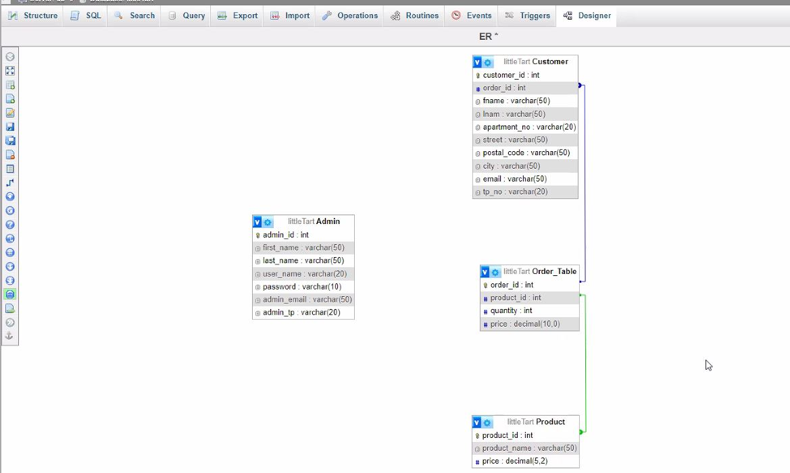

# Exercise 5: Readme.md
# Little Tart Bakers-Team 08

This web page is created for a bakery to do the sales through an online store. The sales are mainly focused on cake products such as various types of cakes and cupcake types.

## Table of Content
- [Features](#features)
- [Database Tables](#database-tables)
- [Forms](#forms)
- [Tables](#tables)

## Features
- [1] Membership form (Manasha Siriwardana)
- [2] Reviews (Chalani Kalpana)
- [3] Careers (A.M.Kushani Lakshika)
- [4] Appointments for Sweet Tasting (Nilmini Pusweli) 
- [5] Online Orders (Nilmini Pusweli) 

      
### 1. Membership form

#### Introduction
The Membership Form on the bakery site offers an exclusive experience for loyal customers. By filling out the Membership Form, customers can join a community of fellow enthusiasts and enjoy a more personalized and rewarding relationship with the bakery.

#### Links
- GitHub:
- shell.hamk.fi:

### 2. Reviews

#### Introduction

#### Links
- GitHub:
- shell.hamk.fi:

### 3. Careers  

#### Introduction
A career feature on this website typically serves as a gateway for individuals seeking employment opportunities within the organization. It provides information about available job positions, requirements, and the application process.

#### Links
- GitHub: https://github.com/AMKLGimhani/LittleTartBakery-WebPro/blob/main/career.php
- shell.hamk.fi: http://shell.hamk.fi/~kushani23000/projectWork/career.php

### 4. Appointments for Sweet Tasting
#### Introduction
The Cake Tasting feature on our website is designed to make customer's cake shopping experience even more delightful. With this feature, customer can schedule a cake tasting session to get a firsthand experience of the flavors and quality of our cakes before making a purchase.

#### Links
- GitHub: https://github.com/AMKLGimhani/LittleTartBakery-WebPro/blob/main/appointment_form.php
- shell.hamk.fi: http://shell.hamk.fi/~nilmini23000/projectWork/appointment_form.php

### 5. Online Order 
            (This task is yet to be completed. Confirmed order should added to the Order table in the database, but this part yet to be completed).
#### Introduction
The online order form on the bakery site is a user-friendly interface designed to streamline the process of purchasing delicious baked goods. The form prompts users to specify quantity and the flavor preferences. 

#### Links
- GitHub: https://github.com/AMKLGimhani/LittleTartBakery-WebPro/blob/main/shop.php
- shell.hamk.fi: http://shell.hamk.fi/~nilmini23000/projectWork/shop.php

## Database Tables

- [ ] DB Table 1 (Admin Table, Created By-A.M.Kushani Lakshika)
- [ ] DB Table 2 (Order Table, Created By-Nilmini Pusweli)
- [ ] DB Table 3 (Product Table, Created By-Nilmini Pusweli)
- [ ] DB Table 4 (Membership Table, Created By-Manasha Siriwardana)
- [ ] DB Table 5 (Customer Table, Created By-Chalani Kalpana)
- [ ] DB Table 6 (Review Table, Created By-Chalani Kalpana)
- [ ] DB Table 7 (Career Table, Created By-A.M.Kushani Lakshika)
- [ ] DB Table 8 (appointments Table, Created By-Nilmini Pusweli)

      
### Table 1 
#### Admin Table
The admin table is designed to store information about administrators or users with administrative privileges in this system.

##### Columns
- admin_id- This is the Primary Key and an integer field that can identify administrators uniquely within the system.
- first_name- A varchar field storing the first name of the administrator.
- last_name- A varchar field storing the last name of the administrator.
- user_name: A varchar field representing the unique username used for authentication and identification.
- password: A varchar field storing the password associated with the administrator's account, likely encrypted or hashed for security.
- admin_email: A varchar field storing the email address associated with the administrator's account for communication and notification purposes.
- admin_tp: A varchar field storing the telephone number or contact number of the administrator, facilitating communication and contact verification.

### Table 2  
#### Order Table

The "Order_Table" stores information about orders placed in a system. It captures details such as the order ID, the product ID of the item ordered, the quantity of the product, and the price per unit. 

##### Columns
- order_id (Primary Key): An integer field uniquely identifying each order placed within the system.
- pid: An integer field representing the unique identifier of the product being ordered. 
- quantity: An integer field representing the quantity of the product ordered in the respective order.
- price: A double field representing the price per unit of the product ordered.
  
##### Constraints
- The "order_id" column serves as the primary key, ensuring each order record is uniquely identifiable.
- pid is a foreign key.

##### Usage
-  Recording orders placed by customers.
-  Calculating total sales revenue based on order quantities and prices.
-  Analyzing customer buying behavior and preferences.

### Table 3  
#### Product Table

The "Product" table facilitates the management of product-related information within the system. It stores essential details about each product, enabling efficient inventory management, pricing strategies, and sales analysis.

##### Columns
- pid (Primary Key): An integer field uniquely identifying each product within the system.
- name: A varchar field representing the name or title of the product.
- image: A varchar fiels representing the images of the products.
- price: A decimal field representing the price of the product, with precision up to two decimal places.
  
##### Constraints
- The "pid" column serves as the primary key, ensuring each product record is uniquely identifiable.
- All columns (id, name, image, price) are marked as "NOT NULL," indicating that they must contain valid data for each product record.

##### Usage
- Cataloging and categorizing products offered by the organization.
- Setting and updating product prices based on market trends and business strategies.
- Tracking product availability and inventory levels.
- Analyzing sales performance and revenue generation by product.

### Table 4
#### Membership Table

The "Membership" table facilitates the management of new member information within the system. It stores essential details about each Member, enabling for the store admins to use the information when needed to benefit the members.

##### Columns
- member_id (Primary Key): An integer field uniquely identifying each Member within the system.
- subscription: A varchar field representing the type of the membership.
- first_name: A varchar fiels representing the first name of the member.
- last_name: A varchar fiels representing the last name of the member.
- apartment_no: A varchar fiels representing the apartment_no of the member.
- street: A varchar fiels representing the street name of the member.
- postal_code: A varchar fiels representing the postal code of the member.
- city: A varchar fiels representing the city name of the member.
- email: A varchar fiels representing the email of the member.
- ph_no:A varchar fiels representing the phone number of the member.

  
##### Constraints
- The "member_id" column serves as the primary key, ensuring each member is uniquely identifiable.
- All columnsare marked as "NOT NULL," indicating that they must contain valid data for each product record.

##### Usage
- Creating and managing member accounts.
- Recording member contact information for marketing and communication purposes.
- Providing personalized services and support as a benefit of the membership.

### Table 5
#### Customer Table
The "Customer" table facilitates the management of customer-related information within the organization. It contains details such as the customer ID, first name, last name, contact address, email address, and telephone number. It stores essential details about each customer, enabling personalized communication, order processing, and customer relationship management.

##### Columns
- customer_id (Primary Key): An integer field uniquely identifying each customer within the system.
- fname: A varchar field representing the first name of the customer.
- lname: A varchar field representing the last name of the customer.
- apartment_no: A varchar field representing the apartment number or unit within the customer's address.
- street: A varchar field representing the street name or address line of the customer's residence.
- postal_code: A varchar field representing the postal or ZIP code of the customer's address.
- city: A varchar field representing the city or locality of the customer's residence.
- email: A varchar field representing the email address of the customer for communication and correspondence.
- tp_no: A varchar field representing the telephone number or contact number of the customer.
  
##### Constraints
- The "customer_id" column serves as the primary key, ensuring each customer record is uniquely identifiable.
- All columns (customer_id, fname, lname, apartment_no, street, postal_code, city, email, tp_no) are marked as "NOT NULL," indicating that they must contain valid data for each customer record.

##### Usage
- Creating and managing customer accounts.
- Recording customer contact information for marketing and communication purposes.
- Processing orders and tracking customer transactions.
- Providing personalized services and support based on customer preferences and history.

### Table 6
#### Review Table

### Table 7
#### Career Table
The career table is used to securely store information submitted by job seekers when applying for positions listed on the website. It typically includes fields such as applicant name, contact details, professional qualifications, and working experiences of the applicant.

### Table 8  
#### appointments Table

The "appointments" table facilitates the customers to schedule a time for cake tasting ans also the management to know the cake tasting scedule of customers. It stores essential details about the visitors, enabling efficient inventory management, pricing strategies, and sales analysis.

##### Columns
- appointment_id (Primary Key): An integer field uniquely identifying each visitor for cake tasting.
- name: A varchar field representing the name or title of the visitor.
- email: A varchar field representing the email address of the visitor.
- tp: A varchar field representing the telephone number or contact number of the visitor.
- date: date field to know the appointment date.
- time: time field to know the booked time.
  

### ER Diagram

## Forms
- [1] Review Form (Chalani Kalpana)
- [2] Membership Form (Manasha Siriwardana)
- [3] Career Form(Kushani Lakshika)
- [4] Appointments Form(Nilmini Pusweli)
- [5] Online order form(Nilmini Pusweli)

### Form 1

#### Review Page

A customer review form is a tool used by businesses to gather feedback and opinions from their customers regarding their products, services, or overall experiences. Typically provided either online or in physical format, these forms ask customers to rate their satisfaction levels, provide comments or suggestions, and sometimes offer specific feedback on various aspects of the business.

These forms serve multiple purposes, including helping businesses identify areas for improvement, gauging customer satisfaction, and gaining insights into customer preferences and expectations. Customer review forms often play a crucial role in shaping future strategies, refining products or services, and enhancing overall customer satisfaction.

In this for we gather information from the customers and request to include customer name, rating and feedback about the products. After the customers feedback it stored in the database table. In the website the reviews are displyed in the website wall.

#### Link
- GitHub:
- shell.hamk.fi:
  

### Form 2

#### Membership Form
 A membership form of the Little Tart Bakery, is a document that individuals can fill out to become members or subscribers. The purpose of the form is to collect necessary information from customers who want to join a membership program or receive exclusive offers and updates from the bakery.

#### Link
- GitHub:
- shell.hamk.fi:
  

### Form 3

#### Career Form

The primary purpose of a Career Form is to allow job seekers to submit their applications for available positions within the organization. Career Forms are designed to collect essential information from job applicants in a structured manner. This includes personal details, educational qualifications, work experience, 
and skills.

#### Link
- GitHub: https://github.com/AMKLGimhani/LittleTartBakery-WebPro/blob/main/career.php
- shell.hamk.fi: http://shell.hamk.fi/~kushani23000/projectWork/career.php
  

### Form 4
#### Appointments Form(Nilmini Pusweli)
Cake tasting appointment form allows the customers to easily schedule a time to come in and sample delicious cakes for their upcoming event. Customer can simply fill out their contact information, choose a desired date and time for the tasting.

#### Link
- GitHub: https://github.com/AMKLGimhani/LittleTartBakery-WebPro/blob/main/appointment_form.php
- shell.hamk.fi: http://shell.hamk.fi/~nilmini23000/projectWork/appointment_form.php

### Form 5
#### Online order-product view form(Nilmini Pusweli)
Products are viewd by this form so that the customers can select the products and add to their shopping cart by clicking on a button.

#### Link
- GitHub: https://github.com/AMKLGimhani/LittleTartBakery-WebPro/blob/main/shop.php
- shell.hamk.fi: http://shell.hamk.fi/~nilmini23000/projectWork/shop.php

## Tables

- [ ] DB Table 1 (Admin Table, Created By-A.M.Kushani Lakshika)
- [ ] DB Table 2 (Order Table, Created By-Nilmini Pusweli)
- [ ] DB Table 3 (Product Table, Created By-Nilmini Pusweli)
- [ ] DB Table 4 (Membership Table, Created By-Manasha Siriwardana)
- [ ] DB Table 5 (Customer Table, Created By-Chalani Kalpana)
- [ ] DB Table 6 (Review Table, Created By-Chalani Kalpana)
- [ ] DB Table 7 (Career Table, Created By-A.M.Kushani Lakshika)
- [ ] DB Table 8 (appointments Table, Created By-Nilmini Pusweli)

### Table 1
#### Admin Table

#### Link

- GitHub:
- shell.hamk.fi: http://shell.hamk.fi/pma/index.php?route=/sql&pos=0&db=wp_kushani23000&table=Admin
  

### Table 2
#### appointments Table
#### Link
- GitHub: https://github.com/AMKLGimhani/LittleTartBakery-WebPro/blob/main/database.md#appointments-table--nilmini-pusweli
- shell.hamk.fi: http://shell.hamk.fi/pma/index.php?route=/table/structure&db=wp_nilmini23000&table=appointments
  

### Table 3
#### Product Table 
#### Link
- GitHub: https://github.com/AMKLGimhani/LittleTartBakery-WebPro/blob/main/database.md#product-table---nilmini-pusweli
- shell.hamk.fi: http://shell.hamk.fi/pma/index.php?route=/table/structure&db=wp_nilmini23000&table=Product
  

### Table 4
#### Order Table
#### Link
- GitHub: https://github.com/AMKLGimhani/LittleTartBakery-WebPro/blob/main/database.md#order-table--nilmini-pusweli
- shell.hamk.fi: http://shell.hamk.fi/pma/index.php?route=/table/structure&db=wp_nilmini23000&table=Order_Table

### Table 5
#### Career Table

#### Link

- GitHub: 
- shell.hamk.fi: http://shell.hamk.fi/pma/index.php?route=/sql&pos=0&db=wp_kushani23000&table=career

