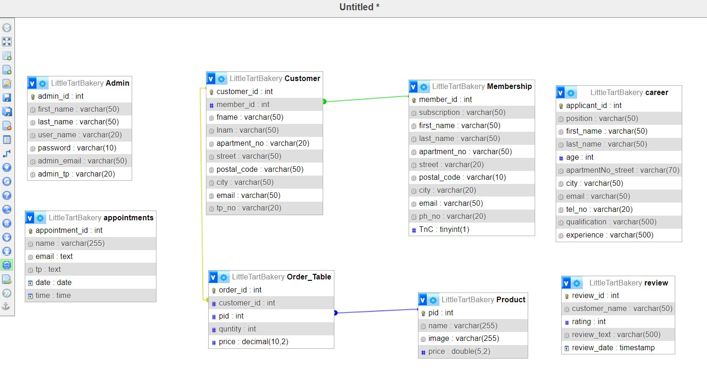

# Exercise 5: Readme.md
# Little Tart Bakers-Team 08

This web page is created for a bakery to do the sales through an online store. The sales are mainly focused on cake products such as various types of cakes and cupcake types.

## Table of Content
- [Features](#features)
- [Database Tables](#database-tables)
- [Forms](#forms)
- [Tables](#tables)

## Features
- [ ] Online Orders (Nilmini Pusweli) 
- [ ] Membership form (Manasha Siriwardana)
- [ ] Reviews (Chalani Kalpana)
- [ ] Careers (A.M.Kushani Lakshika)
      
### 1. Online Order 

#### Introduction
The online order form on the bakery site is a user-friendly interface designed to streamline the process of purchasing delicious baked goods. The form prompts users to specify quantity, flavor preferences, and any special instructions. 

#### Links
- GitHub:
- shell.hamk.fi:

### 2. Membership form

#### Introduction
The Membership Form on the bakery site offers an exclusive experience for loyal customers. By filling out the Membership Form, customers can join a community of fellow enthusiasts and enjoy a more personalized and rewarding relationship with the bakery.

#### Links
- GitHub:
- shell.hamk.fi:

### 3. Reviews

#### Introduction

#### Links
- GitHub:
- shell.hamk.fi:

### 4. Careers  

#### Introduction
A career feature on this website typically serves as a gateway for individuals seeking employment opportunities within the organization. It provides information about available job positions, requirements, and the application process.

#### Links
- GitHub:
- shell.hamk.fi:

## Database Tables

- [ ] DB Table 1 (Admin Table, Created By-A.M.Kushani Lakshika)
- [ ] DB Table 2 (Order Table, Created By-Nilmini Pusweli)
- [ ] DB Table 3 (Product Table, Created By-Nilmini Pusweli)
- [ ] DB Table 4 (Membership Table, Created By-Manasha Siriwardana)
- [ ] DB Table 5 (Customer Table, Created By-Chalani Kalpana)
- [ ] DB Table 6 (Review Table, Created By-Chalani Kalpana)
- [ ] DB Table 7 (Career Table, Created By-A.M.Kushani Lakshika)
      
### Table 1 
#### Admin Table
The admin table is designed to store information about administrators or users with administrative privileges in this system.

##### Columns
- admin_id- This is the Primary Key and an integer field that can identify administrators uniquely within the system.
- first_name- A varchar field storing the first name of the administrator.
- last_name- A varchar field storing the last name of the administrator.
- user_name: A varchar field representing the unique username used for authentication and identification.
- password: A varchar field storing the password associated with the administrator's account, likely encrypted or hashed for security.
- admin_email: A varchar field storing the email address associated with the administrator's account for communication and notification purposes.
- admin_tp: A varchar field storing the telephone number or contact number of the administrator, facilitating communication and contact verification.

### Table 2  
#### Order Table

The "Order_Table" stores information about orders placed in a system. It captures details such as the order ID, the product ID of the item ordered, the quantity of the product, and the price per unit. The "Order_Table" facilitates the management of orders placed within the system. It captures essential details about each order, including the product ordered, the quantity, and the price per unit. This information is vital for tracking sales, managing inventory, and analyzing customer purchase patterns.

##### Columns
- order_id (Primary Key): An integer field uniquely identifying each order placed within the system.
- pid: An integer field representing the unique identifier of the product being ordered. This field likely references a separate table containing product information.
- quantity: An integer field representing the quantity of the product ordered in the respective order.
- price: A decimal field representing the price per unit of the product ordered, with precision up to two decimal places.
  
##### Constraints
- The "order_id" column serves as the primary key, ensuring each order record is uniquely identifiable.
- pid is a foreign key.
- All columns are marked as "Not Null" indicating that they must contain valid data for each record.

##### Usage
-  Recording orders placed by customers.
-  Calculating total sales revenue based on order quantities and prices.
-  Updating inventory levels by deducting sold quantities.
-  Analyzing customer buying behavior and preferences.

### Table 3  
#### Product Table

The "Product" table facilitates the management of product-related information within the system. It stores essential details about each product, enabling efficient inventory management, pricing strategies, and sales analysis.

##### Columns
- pid (Primary Key): An integer field uniquely identifying each product within the system.
- name: A varchar field representing the name or title of the product.
- image: A varchar fiels representing the images of the products.
- price: A decimal field representing the price of the product, with precision up to two decimal places.
  
##### Constraints
- The "pid" column serves as the primary key, ensuring each product record is uniquely identifiable.
- All columns (pid, name, image, price) are marked as "NOT NULL," indicating that they must contain valid data for each product record.

##### Usage
- Cataloging and categorizing products offered by the organization.
- Setting and updating product prices based on market trends and business strategies.
- Tracking product availability and inventory levels.
- Analyzing sales performance and revenue generation by product.

### Table 4
#### Membership Table

The "Membership" table facilitates the management of new member information within the system. It stores essential details about each Member, enabling for the store admins to .

##### Columns
- pid (Primary Key): An integer field uniquely identifying each product within the system.
- name: A varchar field representing the name or title of the product.
- image: A varchar fiels representing the images of the products.
- price: A decimal field representing the price of the product, with precision up to two decimal places.
  
##### Constraints
- The "pid" column serves as the primary key, ensuring each product record is uniquely identifiable.
- All columns (pid, name, image, price) are marked as "NOT NULL," indicating that they must contain valid data for each product record.

##### Usage
- Cataloging and categorizing products offered by the organization.
- Setting and updating product prices based on market trends and business strategies.
- Tracking product availability and inventory levels.
- Analyzing sales performance and revenue generation by product.

### Table 5
#### Customer Table
The "Customer" table facilitates the management of customer-related information within the organization. It contains details such as the customer ID, first name, last name, contact address, email address, and telephone number. It stores essential details about each customer, enabling personalized communication, order processing, and customer relationship management.

##### Columns
- customer_id (Primary Key): An integer field uniquely identifying each customer within the system.
- fname: A varchar field representing the first name of the customer.
- lname: A varchar field representing the last name of the customer.
- apartment_no: A varchar field representing the apartment number or unit within the customer's address.
- street: A varchar field representing the street name or address line of the customer's residence.
- postal_code: A varchar field representing the postal or ZIP code of the customer's address.
- city: A varchar field representing the city or locality of the customer's residence.
- email: A varchar field representing the email address of the customer for communication and correspondence.
- tp_no: A varchar field representing the telephone number or contact number of the customer.
  
##### Constraints
- The "customer_id" column serves as the primary key, ensuring each customer record is uniquely identifiable.
- All columns (customer_id, fname, lname, apartment_no, street, postal_code, city, email, tp_no) are marked as "NOT NULL," indicating that they must contain valid data for each customer record.

##### Usage
- Creating and managing customer accounts.
- Recording customer contact information for marketing and communication purposes.
- Processing orders and tracking customer transactions.
- Providing personalized services and support based on customer preferences and history.

### Table 6
#### Review Table

### Table 7
#### Career Table
The career table is used to securely store information submitted by job seekers when applying for positions listed on the website. It typically includes fields such as applicant name, contact details, professional qualifications, and working experiences of the applicant.

### ER Diagram

## Forms
- [ ] Form 1 (Full Name, Created By)
- [ ] Form 2 (Full Name, Created By)
- [ ] Form 3 (Full Name, Created By)
- [ ] Form 4 (Full Name, Created By)

### Form 1

#### Form Name

#### Link
- GitHub:
- shell.hamk.fi:
  
### Form 2

#### Form Name

#### Link
- GitHub:
- shell.hamk.fi:
  
### Form 3

#### Form Name

#### Link
- GitHub:
- shell.hamk.fi:
  
### Form 4

#### Form Name

#### Link
- GitHub:
- shell.hamk.fi:

## Tables

- [ ] Table 1 (Full Name, Created By)
- [ ] Table 2 (Full Name, Created By)
- [ ] Table 3 (Full Name, Created By)
- [ ] Table 4 (Full Name, Created By)

### Table 1

#### Table Name

#### Link

- GitHub:
- shell.hamk.fi:
- 
### Table 2

#### Table Name

#### Link

- GitHub:
- shell.hamk.fi:
  
### Table 3

#### Table Name

#### Link

- GitHub:
- shell.hamk.fi:
  
### Table 4

#### Table Name

#### Link

- GitHub:
- shell.hamk.fi:

